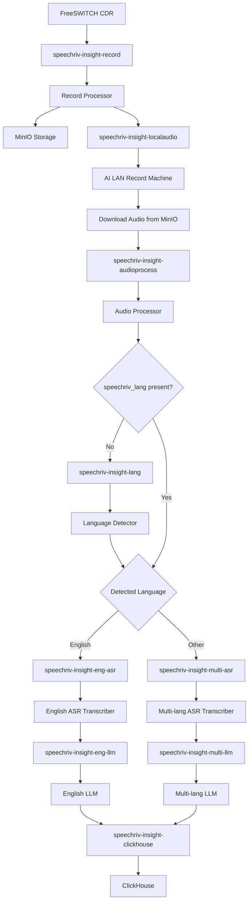

# Post-Call Analytics System

This repository outlines the architecture and data flow for our post-call analytics system. We aim to transform raw Call Detail Records (CDRs) and associated audio into actionable insights, stored and analyzed in ClickHouse.

---

## System Architecture Diagram

This diagram visualizes the end-to-end data pipeline, illustrating how data flows through various components, including Apache Pulsar topics, MinIO storage, and specialized processing modules.

## System Architecture Diagram

-----

## Data Flow Description

Our post-call analytics system is designed with a modular and scalable architecture, primarily leveraging Apache Pulsar for efficient message passing between services.

1. ### CDR Ingestion
    - **FreeSWITCH Server (CDR Source):** Generates CDRs and audio.
    - **Pulsar Topic: `speechriv-insight-record`:** Entry point for raw CDRs.

2. ### Audio Storage and Initial Routing
    - **Record Processor:** Uploads audio to MinIO and forwards reference to `speechriv-insight-localaudio`.
    - **MinIO:** Stores all raw audio files.
    - **Pulsar Topic: `speechriv-insight-localaudio`:** Broadcasts MinIO reference to the AI LAN machine.

3. ### Audio Processing and Language Detection
    - **AI LAN Record Machine:** Downloads audio from MinIO.
    - **Pulsar Topic: `speechriv-insight-audioprocess`:** Sends audio for processing.
    - **Audio Processor:** Splits stereo, checks or sets `speechriv_lang`.
    - **Language Detector:** If lang missing, consumes from `speechriv-insight-lang`.

4. ### Automatic Speech Recognition (ASR)
    - **English ASR → `speechriv-insight-eng-asr`**
    - **Multilang ASR → `speechriv-insight-multi-asr`**
    - Transcribers produce to LLM-specific topics.

5. ### Large Language Model (LLM) Processing
    - **English LLM → `speechriv-insight-eng-llm`**
    - **Multi-lang LLM → `speechriv-insight-multi-llm`**
    - Outputs go to `speechriv-insight-clickhouse`.

6. ### Final Storage
    - **ClickHouse:** Fast analytics-ready database for structured insights.

-----

This detailed flow ensures efficient, secure, and scalable transformation of call recordings into structured, searchable insights.
